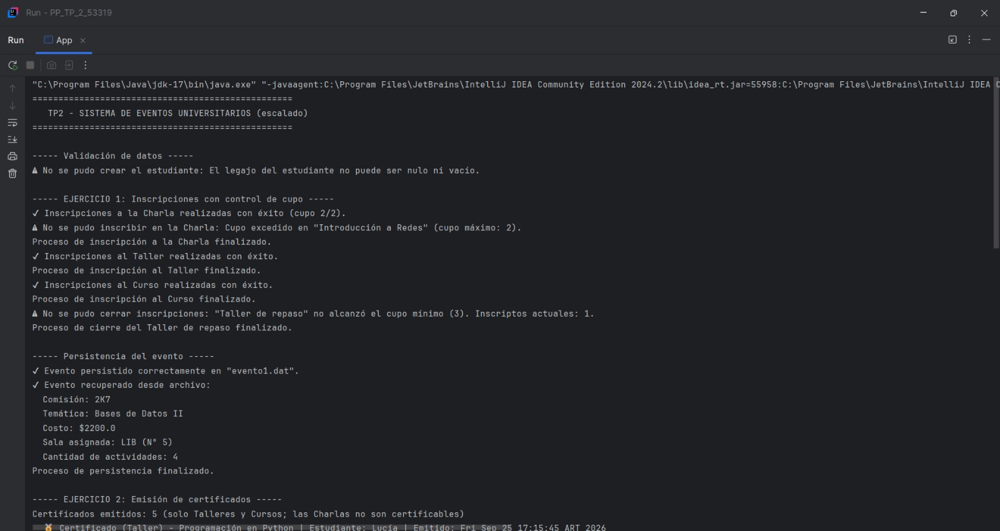
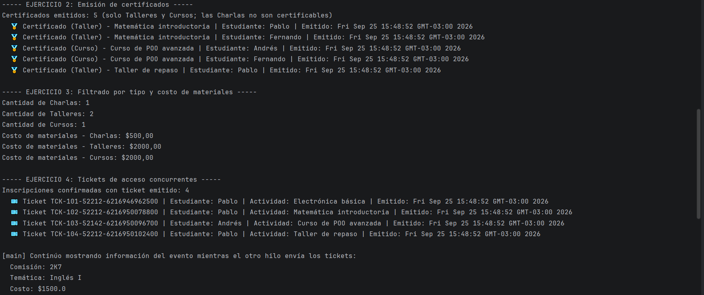
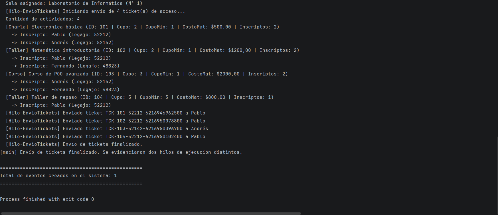

# TP2 — Sistema de Gestión de Eventos Universitarios (POO en Java)

| Campo | Valor                         |
|---|-------------------------------|
| **Materia** | Paradigmas de la Programación |
| **Alumno** | Gabriel Carlos                |
| **Comisión** | 2K7                           |
| **Repositorio** | `PP_TP2_<53319>`              |

---

##  ¿Qué hace este proyecto?

Este trabajo toma el modelo de eventos universitarios de la entrega
anterior y lo lleva un paso más allá: se reorganiza en **packages** y se
incorporan cuatro capacidades nuevas.

1. **Excepciones chequeadas + persistencia**: el sistema tolera fallas
   (cupo excedido, cupo mínimo no alcanzado, datos inválidos) y puede
   guardar y recuperar un `EventoUniversitario` completo desde disco
   mediante serialización.
2. **Interfaces para certificación**: `Taller` y `Curso` pueden emitir
   `Certificado`s porque implementan `Certificable`; `Charla` queda
   afuera de esa capacidad.
3. **Genéricos acotados y wildcards**: `EventoUniversitario` puede
   filtrar sus actividades por subtipo concreto y calcular el costo de
   materiales sobre cualquier lista de actividades, sin importar el
   subtipo exacto.
4. **Clases anidadas + concurrencia**: cada `Inscripcion` sabe generar
   su propio `TicketDeAcceso` (clase miembro), y un hilo aparte
   (`EnvioTicketsThread`) se encarga de despachar esos tickets sin
   frenar la ejecución del programa principal.

---

##  Cómo está organizado el código

src/
├── modelo/
│ ├── Estudiante.java
│ ├── Sala.java (agregación con EventoUniversitario)
│ ├── Actividad.java (abstracta)
│ ├── Charla.java (extends Actividad, NO certificable)
│ ├── Taller.java (extends Actividad, implements Certificable)
│ ├── Curso.java (extends Actividad, implements Certificable)
│ ├── EventoUniversitario.java (composición con Actividad)
│ ├── Inscripcion.java (contiene la clase anidada TicketDeAcceso)
│ └── Certificado.java
├── interfaces/
│ └── Certificable.java
├── excepciones/
│ ├── CupoExcedidoException.java
│ ├── CupoMinimoNoAlcanzadoException.java
│ └── DatosInvalidosException.java
├── persistencia/
│ └── GestorPersistencia.java (serialización/deserialización)
├── hilos/
│ └── EnvioTicketsThread.java (Runnable, envío concurrente de tickets)
└── app/
└── App.java (main)


### Vínculos entre las clases

- **Composición**: un `EventoUniversitario` es dueño de sus
  `Actividad`; no tiene sentido que una actividad exista fuera de un
  evento (se crean vía `evento.crearActividad(...)`).
- **Agregación**: la `Sala` puede existir sin el evento — solo se le
  asigna.
- **Asociación**: `Estudiante` y `Actividad` se vinculan a través de
  `Inscripcion`.
- **Herencia**: `Charla`, `Taller` y `Curso` heredan de `Actividad`.
- **Clase anidada miembro**: `Inscripcion.TicketDeAcceso` no es
  estática, así que necesita la referencia implícita
  `Inscripcion.this` para saber de qué estudiante y actividad es el
  ticket.

---

##  Qué resuelve cada ejercicio

### Ejercicio 1 — Excepciones y persistencia
- `Actividad.inscribir(Estudiante)` tira `CupoExcedidoException` si ya
  no hay lugar.
- `Actividad.cerrarInscripciones()` tira
  `CupoMinimoNoAlcanzadoException` si no se llegó al mínimo requerido.
- Los constructores del modelo validan sus parámetros y lanzan
  `DatosInvalidosException` ante datos nulos, vacíos o fuera de rango.
- `GestorPersistencia` guarda y recupera un `EventoUniversitario`
  entero (sala, actividades e inscripciones incluidas).
- `App` encadena un `try-catch-finally` que inscribe, persiste y
  vuelve a leer el evento, atrapando por separado
  `CupoExcedidoException`, `CupoMinimoNoAlcanzadoException`,
  `FileNotFoundException`, `IOException` y `ClassNotFoundException`.

### Ejercicio 2 — Interfaces y certificados
- `Certificable` define el método `emitirCertificado(Estudiante)`.
- Solo `Taller` y `Curso` la implementan; `Charla` queda fuera a
  propósito.
- `App` recorre las actividades y, con `instanceof Certificable`,
  emite certificados únicamente a quienes se inscribieron en
  actividades certificables.

### Ejercicio 3 — Genéricos acotados y wildcards
- `<T extends Actividad> List<T> filtrarActividadesPorTipo(Class<T> tipo)`
  devuelve listas ya tipadas (`List<Charla>`, `List<Taller>`,
  `List<Curso>`).
- `double calcularCostoMateriales(List<? extends Actividad> actividades)`
  funciona sobre cualquier lista de `Actividad` o de sus subtipos.

### Ejercicio 4 — Clases anidadas e hilos
- `Inscripcion.TicketDeAcceso` es miembro (no estática): un ticket solo
  tiene sentido dentro de una inscripción confirmada concreta.
- `EnvioTicketsThread` (package `hilos`) implementa `Runnable` y
  despacha, con una demora simulada, los tickets de las inscripciones
  confirmadas.
- En `App`, el hilo principal lanza `EnvioTicketsThread` en paralelo y
  sigue mostrando la info del evento mientras el envío ocurre al mismo
  tiempo — se ve en consola el nombre de ambos hilos trabajando.

---

##  Ejecución

**Por línea de comandos** (parado en `src`):
```bash
cd src
javac app/App.java modelo/*.java interfaces/*.java excepciones/*.java persistencia/*.java hilos/*.java
java app.App
```

**Desde IntelliJ IDEA**: abrir el proyecto (`File > Open`), marcar
`src` como *Sources Root* si no lo detecta solo, y correr `app.App`
(clic derecho → `Run 'App.main()'`).

Cada ejecución genera un archivo `evento1.dat` en el directorio de
trabajo — es la evidencia de que la persistencia por serialización
funciona.

---

##  Salida por consola (resumida)

> ⚠️ Los códigos de ticket y el orden exacto de algunas líneas del
> envío pueden variar levemente entre corridas — es esperable en un
> programa concurrente. Reemplazar este bloque por la captura real.
==================================================
TP2 - SISTEMA DE EVENTOS UNIVERSITARIOS (escalado)
==================================================

----- Validación de datos -----
⚠ No se pudo crear el estudiante: El legajo del estudiante no puede ser nulo ni vacio.

----- EJERCICIO 1: Inscripciones con control de cupo -----
✓ Inscripciones a la Charla realizadas con éxito (cupo 2/2).
⚠ No se pudo inscribir en la Charla: Cupo excedido en "Introducción a Redes" (cupo máximo: 2).
Proceso de inscripción a la Charla finalizado.
✓ Inscripciones al Taller realizadas con éxito.
Proceso de inscripción al Taller finalizado.
✓ Inscripciones al Curso realizadas con éxito.
Proceso de inscripción al Curso finalizado.
⚠ No se pudo cerrar inscripciones: "Taller de repaso" no alcanzó el cupo mínimo (3). Inscriptos actuales: 1.
Proceso de cierre del Taller de repaso finalizado.

----- Persistencia del evento -----
✓ Evento persistido correctamente en "evento1.dat".
✓ Evento recuperado desde archivo:
Comisión: 2K7
Temática: Bases de Datos II
Costo: $2200.0
Sala asignada: LIB (N° 5)
Cantidad de actividades: 4
Proceso de persistencia finalizado.

----- EJERCICIO 2: Emisión de certificados -----
Certificados emitidos: 5 (solo Talleres y Cursos; las Charlas no son certificables)
🏅 Certificado (Taller) - Programación en Python | Estudiante: Lucía | Emitido: Fri Sep 25 17:15:45 ART 2026
🏅 Certificado (Taller) - Programación en Python | Estudiante: Gonzalo | Emitido: Fri Sep 25 17:15:45 ART 2026
🏅 Certificado (Curso) - Curso de POO avanzada | Estudiante: Martina | Emitido: Fri Sep 25 17:15:45 ART 2026
🏅 Certificado (Curso) - Curso de POO avanzada | Estudiante: Gonzalo | Emitido: Fri Sep 25 17:15:45 ART 2026
🏅 Certificado (Taller) - Taller de repaso | Estudiante: Lucía | Emitido: Fri Sep 25 17:15:45 ART 2026

----- EJERCICIO 3: Filtrado por tipo y costo de materiales -----

Cantidad de Charlas: 1

Cantidad de Talleres: 2

Cantidad de Cursos: 1

Costo de materiales - Charlas: $500,00

Costo de materiales - Talleres: $2000,00

Costo de materiales - Cursos: $2000,00

----- EJERCICIO 4: Tickets de acceso concurrentes -----
Inscripciones confirmadas con ticket emitido: 4

🎫 Ticket TCK-201-60318-249379123882200 | Estudiante: Lucía | Actividad: Introducción a Redes | Emitido: Fri Sep 25 17:15:45 ART 2026

🎫 Ticket TCK-202-60318-249379132145600 | Estudiante: Lucía | Actividad: Programación en Python | Emitido: Fri Sep 25 17:15:45 ART 2026

🎫 Ticket TCK-103-59904-249379132159000 | Estudiante: Martina | Actividad: Curso de POO avanzada | Emitido: Fri Sep 25 17:15:45 ART 2026

🎫 Ticket TCK-104-60318-249379132167400 | Estudiante: Lucía | Actividad: Taller de repaso | Emitido: Fri Sep 25 17:15:45 ART 2026

[main] Continúo mostrando información del evento mientras el otro hilo envía los tickets:

Comisión: 2K7

Temática: Bases de Datos II

Costo: $2200.0

Sala asignada: LIB (N° 5)

Cantidad de actividades: 4

[Charla] Introducción a Redes (ID: 201 | Cupo: 2 | CupoMín: 1 | CostoMat: $500,00 | Inscriptos: 2)

-> Inscripto: Lucía (Legajo: 60318)

-> Inscripto: Martina (Legajo: 59904)

[Taller] Programación en Python (ID: 202 | Cupo: 2 | CupoMín: 1 | CostoMat: $1200,00 | Inscriptos: 2)

-> Inscripto: Lucía (Legajo: 60318)

-> Inscripto: Gonzalo (Legajo: 61027)

[Curso] Curso de POO avanzada (ID: 103 | Cupo: 3 | CupoMín: 1 | CostoMat: $2000,00 | Inscriptos: 2)

-> Inscripto: Martina (Legajo: 59904)

-> Inscripto: Gonzalo (Legajo: 61027)

[Taller] Taller de repaso (ID: 104 | Cupo: 5 | CupoMín: 3 | CostoMat: $800,00 | Inscriptos: 1)

-> Inscripto: Lucía (Legajo: 60318)

[Hilo-EnvioTickets] Iniciando envío de 4 ticket(s) de acceso...

[Hilo-EnvioTickets] Enviado ticket TCK-201-60318-249379123882200 a Lucía

[Hilo-EnvioTickets] Enviado ticket TCK-202-60318-249379132145600 a Lucía

[Hilo-EnvioTickets] Enviado ticket TCK-103-59904-249379132159000 a Martina

[Hilo-EnvioTickets] Enviado ticket TCK-104-60318-249379132167400 a Lucía

[Hilo-EnvioTickets] Envío de tickets finalizado.
[main] Envío de tickets finalizado. Se evidenciaron dos hilos de ejecución distintos.

==================================================
Total de eventos creados en el sistema: 1
==================================================

Process finished with exit code 0

, , 

---

## 📦 Cómo se entrega este trabajo

1. Crear un repositorio **público** en GitHub llamado
   `PP_TP2_<tu_legajo>` (ej: `https://github.com/tu_usuario/PP_TP2_50268`).
2. Ese repositorio debe incluir:
    - El proyecto completo (hasta el Ejercicio 4), tal como lo generó
      IntelliJ IDEA, listo para clonar y correr.
    - Este mismo `README.md` documentando el trabajo.
    - Una **captura de pantalla** de una ejecución completa por consola.
3. Entregar la **URL de clonado por https** del repositorio en el
   enlace "Entregar Trabajo Práctico N.º 2".